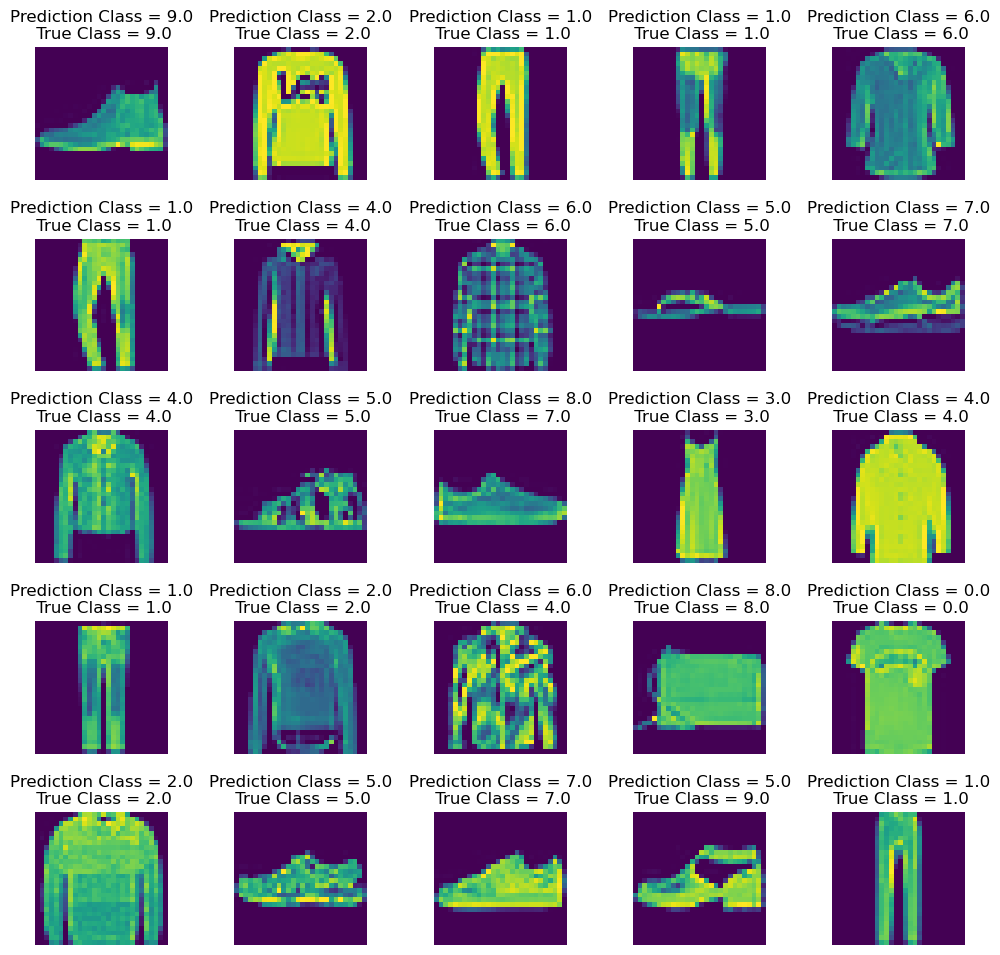
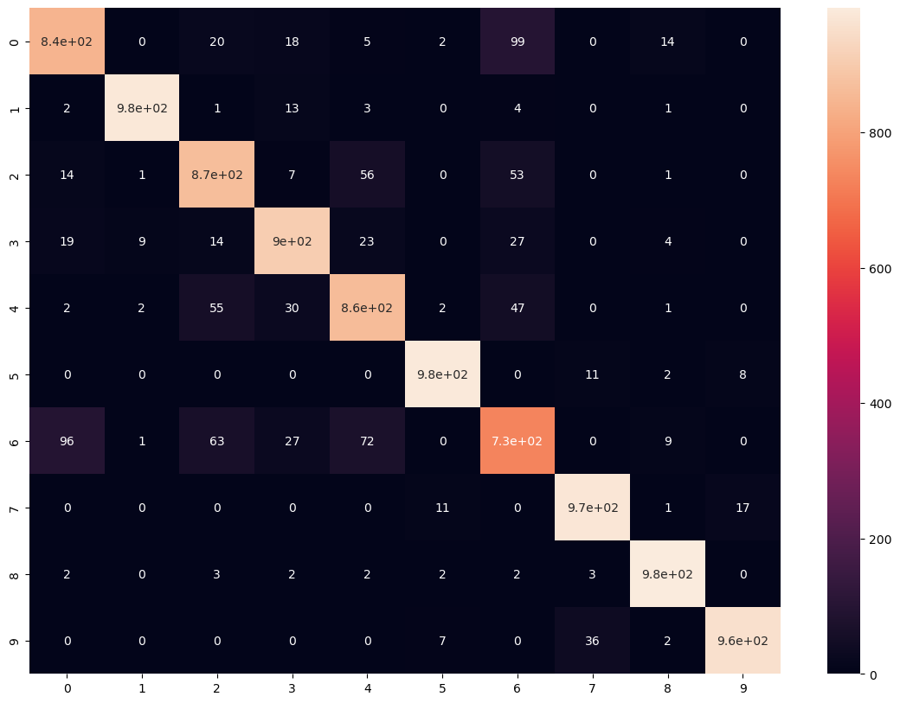

# **Fashion** **Class** **Classification**

## Problem Statement

Fashion training set consists of 70,000 images divided into 60,000 training and 10,000 testing samples. Dataset sample consists of  28x28 grayscale images, associated with a label from 10 classes.

 The 10 classes are as follows:
 0 -> T-shirt/ top, 1-> Trouser, 2-> Pullover, 4 -> Coat, 5-> Sandal, 6->Shirt, 7-> Sneaker, 8-> Bag, 9-> Ankle boot

 Each image is 28 pixels in height and 28 pixels in width for a total of 784 pixels. Each pixel has a single pixel value associated with it, indicating the lightness or the darkness of that pixel, with higher numbers meaning darker. This pixel value is an integer between 0 and 255.

We need solve the classification problem using neural networks

## Tools Used

1. Numpy
2. tensorflow
3. Keras
4. CNN

## Results & Predictions

1. Train accuracy = 0.9649 , Validation accuracy = 0.9191
2. Test accuracy = 0.907

**Prediction**

**Confusion** **Matrix**

**Classification** **Report**

